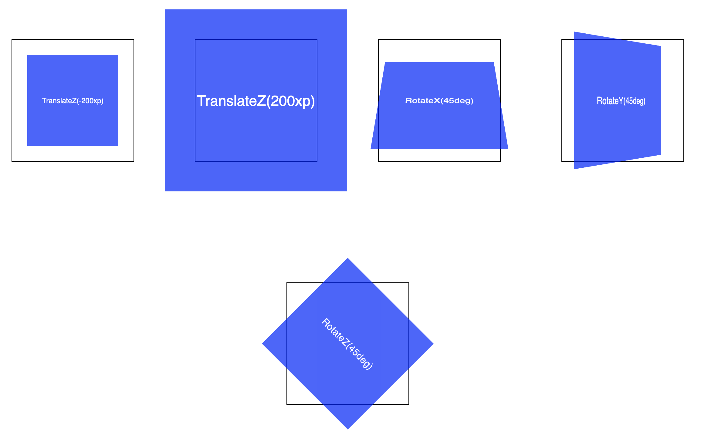
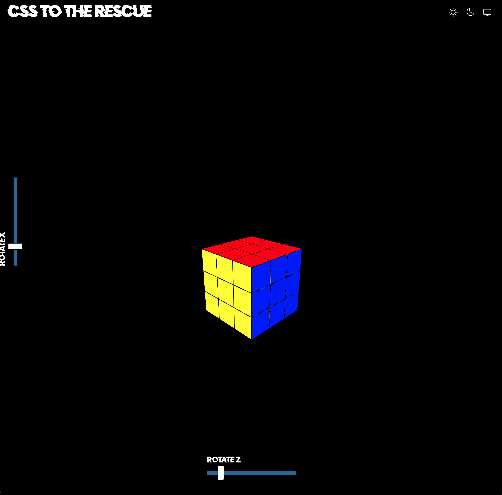
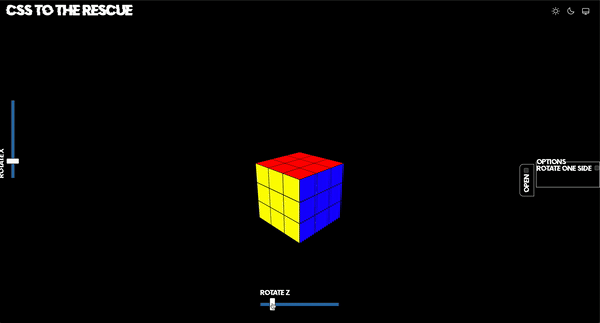
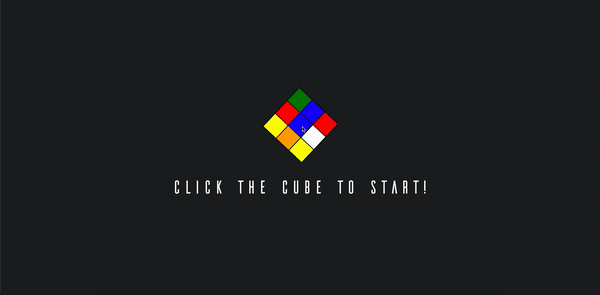
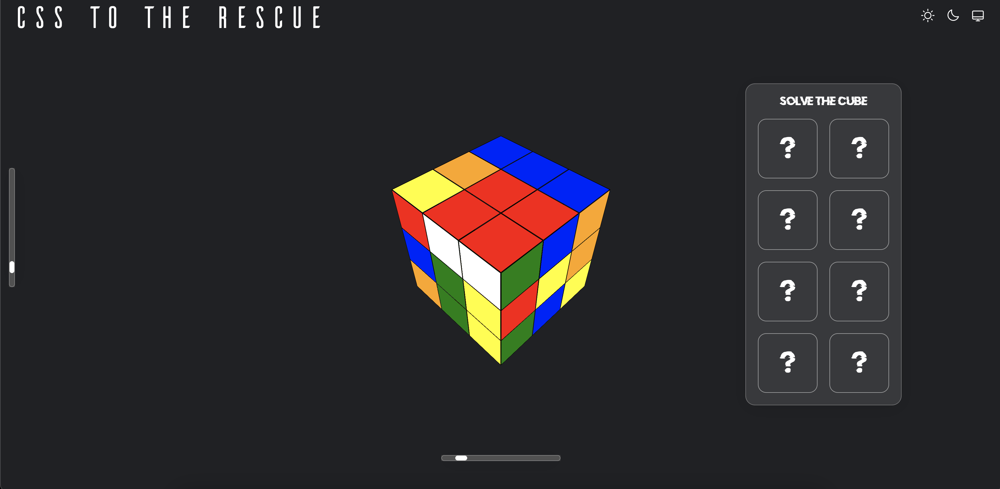
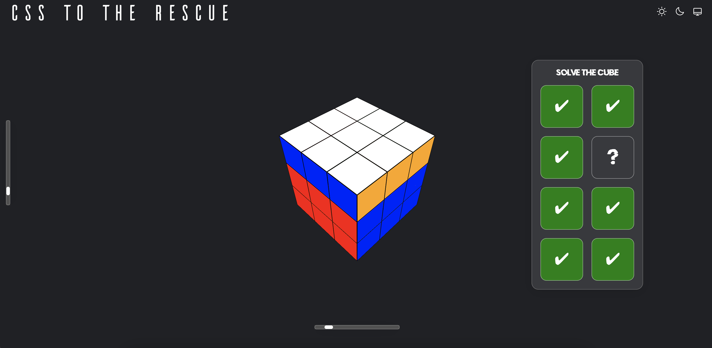
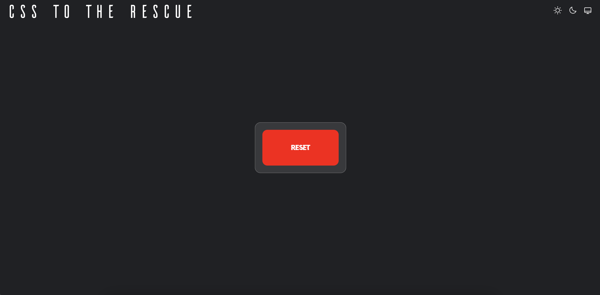

# CSS to the Rescue - Rubik's Cube

This is the process report for the CSS to the Rescue course. This course was given by the lecturers:

<li>Sanne 't Hooft</li>
<li>Nils Binder</li>
<li>Roel Nieskens</li>

## Assignment

The main goal of this course was to experiment with new CSS features and see what is possible to do with all CSS and
**NO JavaScript**. In the first lesson we were given the four options to choose from. These were:

<ul>
    <li>Make a control panel</li>
    <li>Create a firework show</li>
    <li>Build a Rubik's Cube (Hard)</li>
    <li>Fold a paper plane (Hard)</li>
</ul>

For me the Rubik's Cube looked like a real challenge, so I was intrigued to go for the cube. I was not yet sure if it
would be doable. How cool would it be to be able to code your own working Rubik's Cube. One given requirement for
choosing one of the harder assignments was that you could solve a given math problem. Sanne 't Hooft gave me a fun math
problem to solve, and it went as follows:

"Two student just graduated and want to start working at a law firm. When they are at their job interview, the manager
gives them two options for payment: 1. Receive €80 every day; 2. Receive €0,01 on the first day and have it be
multiplied every next day."

**Which is the better option to choose?**

Since I had not really done any math for over 5/6 years, the problem was a bit harder for me than I hoped. One thing I
knew for sure was that the first option uses linear growth and the second options uses exponential growth. Since
exponential growth always becomes more in value faster that linear growth, this would definitely be the option to
choose. Now I really wanted to solve the problem by knowing how many days it would take for the second option to be more
lucrative than the first option.

Since math wasn't on my brain for the past years, I had to look up the formula to calculate exponential growth. It goes
like this:

``
f(x) = ab^x
``

[//]: # (FINISH THIS PART ABOUT MATH PROBLEM)

When I completed the math problem I was confident again about my mathematical ability. I was ready to take on the Cube!

### Further Requirements

<ol>
    <li>
        Selector first CSS and no JS approach
        <ul>
            <li>Do not use ID's and classes</li>
            <li>No JavaScript, range input code excluded. <a href="#rangeCode">Read more</a></li>
        </ul>
    </li>
    <li>Use at least two of following CSS techniques in a useful way: CSS nesting, @layer, container queries, style 
        queries.
    </li>
    <li>Sensational yet fitting typographic title</li>
    <li>
        Apply the guidelines you've learned in previous years
        for writing clean and elegant code
        <ul>
            <li>Responsive</li>
            <li>Accessible</li>
            <li>Custom props</li>
            <li>Semantics</li>
        </ul>
    </li>
</ol>

---

## Process

These are the steps I took to make my Rubik's Cube:
<ol>
    <li>Build a single cube in 3D</li>
    <li>Control the cube using range inputs</li>
    <li>Build the full Rubik's Cube</li>
    <li>Rotate one side of the Rubik's Cube</li>
    <li>Rework</li>
    <li>If I had more time...</li>
</ol>

### Step 1: Build a single cube in 3D

Before I started this assignment, I had no idea how to work with 3D in CSS. This is also one of the reasons why I chose
this assignment. The first step was to figure out how to make a cube in 3D. I found this website that gives an intro to
3D in CSS. Here I got introduced to perspective, 3D transform functions and making 3D objects. I followed the tutorial
all the way to learning how to create a cube in CSS. This course was really helpful for me. It instructed every step
very clearly and went in to detail of how 3D in CSS works.

#### Perspective

To define a 3D CSS you're defining a space or a scene in which the 3D takes place. To do this the given element should
have a perspective applied. The intensity of the 3D effect is determined by the value of perspective. Consider
perspective as the distance between the viewer and the object; the higher the value, the greater the distance, the less
intense the visual effect (<i>Perspective · Intro to CSS 3D Transforms</i>, n.d.). This can be done in two ways:

The first method is by using the perspective function

```css
.element {
    transform: perspective(400px);
}
```

The second method is by using the perspective property

```css
.element {
    perspective: 400px;
}
```

When you work with more than one element that needs the same vanishing point (perspective), the first functional option
doesn't work out well. Every element gets its own perspective applied and the elements don't line up together. For my
use case of making a cube every panel or side needs to have the same perspective. This means I will have to work with
the second notation.

#### 3D Transform Functions

Because I am now working with three dimensions there are some other function to get to know and to work with. These are:

<ul>
    <li>translateZ(px)</li>
    <li>rotateX(deg)</li>
    <li>rotateY(deg)</li>
    <li>rotateZ(deg)</li>
</ul>

To fully understand and see the effects applied by these functions I have made a
little <a href="https://codepen.io/crazyivan117/pen/gOyLdZR">codepen</a> which showcases the
different effects.



#### Building a Cube

To build a cube in 3D I first started by setting up my HTML. This was fairly easy to do, because a cube has 6 faces. In
the tutorial I learned that it is a good practice to separate the 3D space and the 3D object. By doing this the code is
easier to read, style and understand. The HTML for the single cube will look something like this:

```html

<div class='space'>
    <div class='cube'>
        <div class='front-side side'>Front</div>
        <div class='back-side side'>Back</div>
        <div class='left-side side'>Left</div>
        <div class='right-side side'>Right</div>
        <div class='top-side side'>Top</div>
        <div class='bottom-side side'>Bottom</div>
    </div>
</div>
```

To make the first setup for building the cube I have applied this styling:

```css
.space {
    perspective: 600px;
    width: 200px;
    height: 200px;
}

.cube {
    width: 100%;
    height: 100%;
    position: relative;
    transform-style: preserve-3d;
    transform: translateZ(-100px);
}

.side {
    width: 100%;
    height: 100%;
    position: absolute;
    border: 1px solid black;
    opacity: 0.5;
    color: black;
    display: flex;
    align-items: center;
    justify-content: center;
    font-size: 1.5rem;
    text-transform: uppercase;
}
```

This first styling defines the dimensions for the 3D space and positions every side of the cube on top of each other.
Here I used position absolute, but Sanne 't Hooft showed me another way of doing this by defining a grid area.

```css
.cube {
    display: grid;
}

.side {
    grid-area: 1/1;
}
```

---

**Important!**

Since the 3D effect is applied to the scene and we want to pass the 3D effect down to it is children it is required to
apply the property `transform-style: preserve-3d` to the `.cube`.

---

Now it is time to build my cube. Every side needs to be rotated in their correct position to form the cube. I also apply
the correct colors of the Rubik's Cube to every side. To make sure that the sides are in their correct place and pushed
out to the side of the cube, I apply a `translateZ(100px)` to every side. It is a 100px because every side is 200px in
height and width and from the center of the cube it needs half the distance. If you don't do this your cube will look
like the second image.

<div style="display: flex; gap: 10px">
    
    
    
</div>

Here is the CSS to apply to every side and complete the cube. We now have the result shown on the third image!

```css
.front-side {
    background-color: red;
    transform: rotateY(0deg) translateZ(100px);
}

.back-side {
    background-color: orange;
    transform: rotateY(180deg) translateZ(100px);
}

.left-side {
    background-color: green;
    transform: rotateY(-90deg) translateZ(100px);
}

.right-side {
    background-color: blue;
    transform: rotateY(90deg) translateZ(100px);
}

.top-side {
    background-color: white;
    transform: rotateX(90deg) translateZ(100px);
}

.bottom-side {
    background-color: yellow;
    transform: rotateX(-90deg) translateZ(100px);
}
```

---

### Step 2: Control the cube using range inputs

<div id="rangeCode"></div>

The next step for me to do is making the cube rotate by listening to the range inputs. This can only be done by
using JavaScript and is also the only piece of JS code allowed in this course. In my case the range inputs need to pass
a degree value to the rotates custom properties and number value to the opacity custom property. That is why I added the
conditional statement of when the rangeName is one of the rotates, it adds the degree unit behind it.

```javascript
const ranges = document.querySelectorAll('[type="range"]');

const updateRange = range => {
  // the name of the custom property is the name of the input
  const rangeName  = range.name;
  // the value of the custom property is the value of the input 
  const rangeValue = range.value;
  // a custom property is set on the HTML element

  if (rangeName === 'rotatex' || rangeName === 'rotatey' || rangeName === 'rotatez') {
    document.documentElement.style.setProperty("--" + rangeName, rangeValue + "deg");
  } else {
    document.documentElement.style.setProperty("--" + rangeName, rangeValue);
  }
}

ranges.forEach(range => {
  // the custom property is set initially after loading the document
  updateRange(range);

  // the custom property is updated when the input is changed
  range.oninput = () => {
    updateRange(range)
  };
});
```

#### The Result


---

### Step 3: Build the full Rubik's Cube

Now the fun (and hard) part begins. When I first started building the cube I didn't really have an idea of where to
start and I just duplicated the cube I already had 26 times. Then I had one long line of cubes. With a lot of trial and
error just trying out some translates, I made the whole cube. The code didn't look nice, but it worked. Here you can see
the css I had at the time:

```css
main > div > div > div:nth-of-type(4) {
    transform: translateY(-200px) translateX(calc(200px / 3));
}

main > div > div > div:nth-of-type(5) {
    transform: translateY(-200px) translateX(calc(200px / 3));
}

main > div > div > div:nth-of-type(6) {
    transform: translateY(-200px) translateX(calc(200px / 3));
}

main > div > div > div:nth-of-type(7) {
    transform: translateY(-400px) translateX(calc(200px - (200px / 3)));
}

main > div > div > div:nth-of-type(8) {
    transform: translateY(-400px) translateX(calc(200px - (200px / 3)));
}

main > div > div > div:nth-of-type(9) {
    transform: translateY(-400px) translateX(calc(200px - (200px / 3)));
}

main > div > div > div:nth-of-type(10) {
    transform: translateY(-600px) translateZ(calc(-200px / 3));
}

main > div > div > div:nth-of-type(11) {
    transform: translateY(-600px) translateZ(calc(-200px / 3));
}

main > div > div > div:nth-of-type(12) {
    transform: translateY(-600px) translateZ(calc(-200px / 3));
}

main > div > div > div:nth-of-type(13) {
    transform: translateY(-800px) translateX(calc(200px / 3)) translateZ(calc(-200px / 3));
}

main > div > div > div:nth-of-type(14) {
    transform: translateY(-800px) translateX(calc(200px / 3)) translateZ(calc(-200px / 3));
}

main > div > div > div:nth-of-type(15) {
    transform: translateY(-800px) translateX(calc(200px / 3)) translateZ(calc(-200px / 3));
}

main > div > div > div:nth-of-type(16) {
    transform: translateY(-1000px) translateX(calc(200px - (200px / 3))) translateZ(calc(-200px / 3));
}

main > div > div > div:nth-of-type(17) {
    transform: translateY(-1000px) translateX(calc(200px - (200px / 3))) translateZ(calc(-200px / 3));
}

main > div > div > div:nth-of-type(18) {
    transform: translateY(-1000px) translateX(calc(200px - (200px / 3))) translateZ(calc(-200px / 3));
}

main > div > div > div:nth-of-type(19) {
    transform: translateY(-1200px) translateZ(calc(-400px / 3));
}

main > div > div > div:nth-of-type(20) {
    transform: translateY(-1200px) translateZ(calc(-400px / 3));
}

main > div > div > div:nth-of-type(21) {
    transform: translateY(-1200px) translateZ(calc(-400px / 3));
}

main > div > div > div:nth-of-type(22) {
    transform: translateY(-1400px) translateX(calc(200px / 3)) translateZ(calc(-400px / 3));
}

main > div > div > div:nth-of-type(23) {
    transform: translateY(-1400px) translateX(calc(200px / 3)) translateZ(calc(-400px / 3));
}

main > div > div > div:nth-of-type(24) {
    transform: translateY(-1400px) translateX(calc(200px / 3)) translateZ(calc(-400px / 3));
}

main > div > div > div:nth-of-type(25) {
    transform: translateY(-1600px) translateX(calc(200px - (200px / 3))) translateZ(calc(-400px / 3));
}

main > div > div > div:nth-of-type(26) {
    transform: translateY(-1600px) translateX(calc(200px - (200px / 3))) translateZ(calc(-400px / 3));
}

main > div > div > div:nth-of-type(27) {
    transform: translateY(-1600px) translateX(calc(200px - (200px / 3))) translateZ(calc(-400px / 3));
}
```



### Step 4: Rotate one side of the Rubik's Cube

I set a first challenge for myself and that was to rotate one side of the cube. If I wanted to do more, I could always
go on when the first rotate was successful. Again I did this in a very hacky way. I did manage to successfully rotate
one side using the CSS below. The only thing was that the rotation didn't look very clean and all the cubes were
squished together when the rotation was happening. But then again it was a rotation!

```css
:root:has(input[name="rotateSide"]:checked) main > div > div > div:nth-of-type(7) {
    transform: translateY(-400px) translateX(calc(200px - (200px / 3))) translateZ(calc(-400px / 3)) rotateX(90deg);
}

:root:has(input[name="rotateSide"]:checked) main > div > div > div:nth-of-type(8) {
    transform: translateY(-466px) translateX(calc(200px - (200px / 3))) translateZ(calc(-200px / 3)) rotateX(90deg);
}

:root:has(input[name="rotateSide"]:checked) main > div > div > div:nth-of-type(9) {
    transform: translateY(-533px) translateX(calc(200px - (200px / 3))) rotateX(90deg);
}

:root:has(input[name="rotateSide"]:checked) main > div > div > div:nth-of-type(16) {
    transform: translateY(-933px) translateX(calc(200px - (200px / 3))) translateZ(calc(-400px / 3)) rotateX(90deg);
}

:root:has(input[name="rotateSide"]:checked) main > div > div > div:nth-of-type(17) {
    transform: translateY(-1000px) translateX(calc(200px - (200px / 3))) translateZ(calc(-200px / 3)) rotateX(90deg);
}

:root:has(input[name="rotateSide"]:checked) main > div > div > div:nth-of-type(18) {
    transform: translateY(-1066px) translateX(calc(200px - (200px / 3))) rotateX(90deg);
}

:root:has(input[name="rotateSide"]:checked) main > div > div > div:nth-of-type(25) {
    transform: translateY(-1466px) translateX(calc(200px - (200px / 3))) translateZ(calc(-400px / 3)) rotateX(90deg);
}

:root:has(input[name="rotateSide"]:checked) main > div > div > div:nth-of-type(26) {
    transform: translateY(-1533px) translateX(calc(200px - (200px / 3))) translateZ(calc(-200px / 3)) rotateX(90deg);
}

:root:has(input[name="rotateSide"]:checked) main > div > div > div:nth-of-type(27) {
    transform: translateY(-1600px) translateX(calc(200px - (200px / 3))) rotateX(90deg);
}
```

#### The Result



### Step 5: Rework

When I had undertaken the previous steps, I was really stuck with my progress. I approached Sanne 't Hooft and he helped
me in an unbelievable great way. He showed me how to position the single cubes correctly using `custom properties`. This
way I could rotate the cubes from the center of the given axis and individually. When he helped me and gave me a little
boost, I fully expanded my cube game and was able to rotate the cube three times.

I wanted to recreate the feeling of solving a Rubik's Cube. I added some interactive elements as a puzzle. I first
rotated the cube three times and then used those rotate-x, rotate-y and rotate-z values as the start configuration for
my cube. When the user clicks the buttons in the correct order, the cube is solved. But when the user clicks the wrong
button an `EXPLOSION` is triggered. 

One of the requirements was also to have a compelling title for your project, so I added a cool entrance that uses the 
3d space to slide in certain content. Adding this made it feel like a real game! 

## Result

On the day of the deadline Sanne and me were trying to fix one cube that was already rotated three times and could not 
easily be rotated again. So we came up with a solution to make custom properties for every rotate. This way the axes 
would stay in their place and I was able to rotate the cube `eight` times!!! Now you have to figure out the order in 
which the buttons have to be clicked and then when the user clicks finish the explosion triggers. I'm unbelievably proud
of what I accomplished and it looks awesome!






### If I had more time...

If I had more time I would've incorporated logic to change the theme of cube and the website. I would have loved to
experiment with the possibility of different measurements for the cube. It would be so cool (and now easy with the
custom properties) to do. Then I could have a `5x5`, or maybe `7x7` cube.

### Reflection

I really loved this `CSS to the Rescue` course. I'm really satisfied with my final result and I'm proud of what I made.

## Sources

<ul>
    <li>Perspective · Intro to CSS 3D transforms. (n.d.). https://3dtransforms.desandro.com/perspective</li>
    <li>CSS: Cascading Style Sheets | MDN. (2024, January 2). MDN Web Docs. https://developer.mozilla.org/en-US/docs/Web/CSS/transform-function</li>
</ul>
